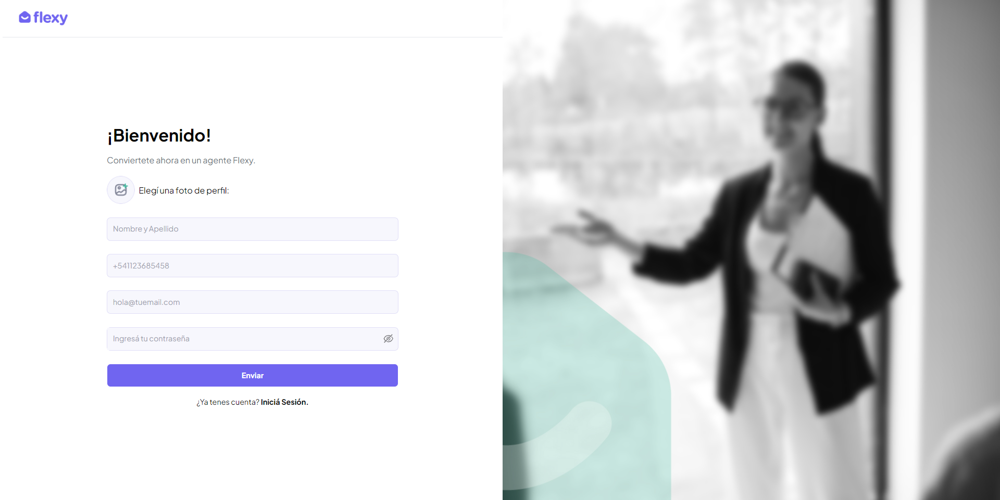
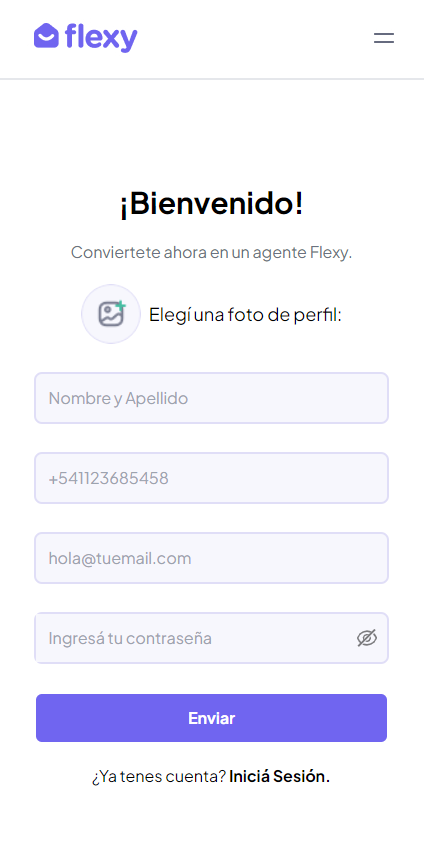

# Flexy Register

Prueba técnica para la app Flexy.

## Contenidos:

1.  [Objetivo del proyecto](#objetivo-del-proyecto)
2.  [Maquetado](#maquetado)
    -   Version Desktop
    -   Version Responsive
3.  [Boilerplate del proyecto](#boilerplate-del-proyecto)
4.  [Características del proyecto](#caracteristicas-del-proyecto)
5.  [Comportamiento esperado](#comportamiento-esperado)
6.  [Tecnologías utilizadas](#tecnolog%C3%ADas-utilizadas)
    -   React Router
    -   Zustand
    -   React Hook Form
    -   Sweet Alert
    -   Tailwind.css
    -   DaisyUI
7.  [Estructura del proyecto](#estructura-del-proyecto)
    -   Componentes
    -   Utils
    -   Store

## [Objetivo del proyecto](#objetivo-del-proyecto)

Desarrollar un front de acuerdo al maquetado pasado por [Figma](https://www.figma.com/file/j7PhhMDHi83NosWXWTt2PU/Prueba-t%C3%A9cnica?node-id=1%3A2101&mode=dev).

## [Maquetado](#maquetado):

### Version Desktop



### Version Responsive



## [Boilerplate del proyecto](#boilerplate-del-proyecto)

El proyecto fue creado con el comando `pnpm create vite-app@latest` usando el manejador de versiones [pnpm](https://pnpm.io/es/), usando la plantilla inicial [react-ts w/swc](https://stackblitz.com/edit/vitejs-vite-erq3ox?file=index.html&terminal=dev).

Para correr el proyecto en el localhost:5173, primero es necesario instalar las dependencias con `pnpm install` y luego correrlo con el comando `pnpm dev`.

## [Características del proyecto](#caracteristicas-del-proyecto)

Este proyecto fué desarrollado con React, con una estructura SPA y cuenta con dos rutas:

1. `/`: contiene el componente `Register` que se encarga de la validacion de los datos del formulario.
2. `/login`: contiene el componente `Login` que se encarga de verificar los datos del usuario, ingresados en `Register` para el inicio de sesión.

Dado que este proyecto no cuenta con un backend real, para simular una base de datos se utiliza el sessionStorage del navegador en conjunción con el estado general de la app, por lo que se puede "registrar" un usuario, y luego se puede loguear ese usuario con las mismas credenciales.

## [Comportamiento esperado](#comportamiento-esperado)

- Validación de Inputs: Los inputs cuentan con validaciones propias. Si no se cumplen estas condiciones, aparecerá un mensaje de error debajo del correspondiente elemento.

- Validación del Formulario: Se ha implementado un patrón Regex esperado para cada elemento del formulario, si los datos ingresados al momento de dar submit no siguen dicho patron no se podra dar submit hasta que se corrijan los elementos señalados.

- Al registrarse correctamente, se disparará un modal, dando la bienvenida al usuario, pero al no tener una pagina de inicio, no habrá una redirección. El usuario se guardará en el sessionStorage del navegador como un objeto con las propiedades extraidas del formulario.

- Al loguearse correctamente, se disparará el mismo modal (con otro texto); al existir problemas con el login, el modal informará al usuario del problema.

## [Tecnologías utilizadas](#tecnologías-utilizadas)

El proyecto utiliza:

- [React Router](https://reactrouter.com/en/main): En particular su versión para manejo del DOM. React router hace posible la implementacion de una estructura SPA (Single page app), donde las rutas definidas se encargan de renderizar los componentes.

- [Zustand](https://zustand-demo.pmnd.rs/): Se utilizó para persistir el estado entre componentes, y para aplicar la lógica para el login. A su vez, una vez correctamente registrado el usuario, se guarda en el sessionStorage.

- [React Hook Form](https://react-hook-form.com/): Ésta libreria de React simplifica el manejo de formularios del lado del cliente. Al no tener la aplicacion un modelo de información, este se definió en principio en el estado global de la App con Zustand, y por otro se implementó patrones con regex para la validacion de los datos esperados:

```jsx
<input
  type="text"
  {...register("fullName", {
    required: true,
    pattern: {
      value: /^[A-Za-z]{2,}( [A-Za-z]{2,})+$/i,
      message: "Debe ingresar nombre y apellido",
    },
  })}
/>
```

  En este ejemplo se estableció un patrón que espera al menos dos cadenas de texto separadas por un espacio en blanco. Los errores se registran en el estado general del formulario y se devuelven al usuario de manera condicional:

```jsx
  <label>
    <input type="text"... />
    {errors?.fullName ? <p>{errors.fullName?.message as string}</p> : null}
  </label>
```

- [Sweet Alert](https://github.com/sweetalert2/sweetalert2-react-content): Ésta libreria permite la creacion de comandos `alert()` con contenido, estilos y funciones definidas por el desarrollador. Se crearon tres instancias de `Swal` en la carpeta utils, las que toman informacion del usuario para renderizar un alerta costumizada tanto para el registro exitoso, como para el login exitoso o fallido.

- [Tailwind.css](https://tailwindcss.com/): para estilado inline y diseño responsive. Se definieron breakpoint personalizados en el archivo `tailwind.config.js`:

  ```js
    themes: {
      screens: {
        'lg': '1024px',
        'sm': '200px'
      }
    }
  ```

  Tailwind adopta un diseño _mobile first_ con lo que los breakpoint siguen el modelo de `@media screen (min-width: ...)`. Los estilos se aplicarán hasta que se presente el siguiente breakpoint definido.

  Para los colores definidos en las plantillas de figma se hizo lo mismo, pero en el apartado colores:

  ```js
    themes: {
      colors: {
        primary: '#7065F0',
        white: '#FFF',
        black: '#000',
        background: '#F7F7FD',
        border: '#E0DEF7',
        neutral: colors.gray,
        red: colors.red
      }
    }
  ```

- [DaisyUI](https://daisyui.com/): Libreria de componentes basados en Tailwind.css. Al integrarse con tailwind, los componentes pueden aplicarse de manera sencilla con el método `className`. En éste caso fue implementado en el formulario de registro, para informar al usuario de los patrones esperados en el ingreso de datos:

```jsx
  <label
    type='tel'
    className='tooltip tooltip-top  tooltip-primary'
    data-tip='Codigo internacional + codigo regional + tel'
  >
```
  En éste ejemplo se define un componente `tooltip` que muestra su contenido arriba del elemento en el que se implementa. La propiedad `data-tip` guarda el contenido que se muestra dentro del tooltip.

## [Estructura del proyecto](#estructura-del-proyecto)

### Componentes

- Vista de Registro.

  Utiliza dos componentes: `RegisterBody.tsx` que se encarga del renderizado del componente que se monta en `Register.tsx` y `RegisterForm.tsx` que maneja el estado y la logica de validación del formulario. Éste componente en particular, importa e implementa `ProfilePicture.tsx` que usa la API `FileReader` para hacer un mock de la subida de la foto de perfil. Se lo separó para evitar sobrecargar el componenete principal.

- Vista de Login.

  Sigue la misma logica que `Register.tsx`: Utiliza `LoginBody.tsx` para el renderizado y `LoginForm.tsx` para la validación del formulario.

  Ámbas vistas se importan al componete principal `App.tsx` que maneja las rutas de navegación.

### Utils

Para evitar añadir más procesamiento en los componentes, se movió la definicion de los mensajes de bienvenida/error al archivo `SweetAlert.ts`, desde alli se exportan y se usan de manera condicional en los componentes `Register.tsx` y `Login.tsx`.

### Store

Es una práctica recomendada aislar y manejar el estado global de la App en su carpeta individual, al usar algún gestor externo de estado como Zustand. En el archivo `userStore.ts` se define el estado inicial, y el método para actualizarlo.
